# Homework 2 - Exact and heuristic solutions of the Knapsack Problem

## Problem Statement
The 0/1 knapsack problem is a classic combinatorial optimization challenge, involving the selection of items with given weights and values to maximize total value without exceeding a specified weight limit. 
\
This task involves implementing and analyzing various solution methods for the optimization version of the problem. Exact solutions are required using the branch-and-bound approach and dynamic programming. Heuristic methods should include basic and modified cost/weight ratio strategies. The implementation of the Fully Polynomial-Time Approximation Scheme (FPTAS) is also necessary to examine the balance between accuracy and computational efficiency.

## Analysis and Description of Possible Solutions
When solving the 0/1 knapsack problem, I had to consider several approaches, each with its own strengths and weaknesses.

Branch-and-Bound (B&B)
\
This method lets me systematically narrow down the possible combinations of items by breaking the problem into smaller branches. It uses a specific rule to skip over branches that can't possibly lead to the best solution. While this guarantees finding the perfect answer, it can be slow for big problems.

Simple Cost/Weight Heuristic
\
In this algorithm I prioritize items based on their cost-to-weight ratio and keep adding items to the knapsack until it's full. It's fast, but it doesn’t always give the best solution. For example, it might skip a high-value item just because it’s heavy.

Extended Cost/Weight Heuristic
\
Similar to the Simple Cost/Weight Heuristic, this method also sorts items by their cost-to-weight ratio. However, it also compares this solution with the solution of adding only the most expensive item and returns the better one. 

Dynamic Programming (DP)
\
Dynamic programming is always based on decomposition, breaks the problem into smaller subproblems and builds up the solution step by step.
For knapsack problems, I can structure this in two ways: by the total cost and by the knapsack capacity
\
I choose method decomposition by total cost. It is a 0/1 inverse knapsack problem systematically exploring different combinations of items based on their costs and weights. The algorithm efficiently solves the problem by preventing redundant computations through memoization, resulting in a solution that guarantees optimality with a pseudopolynomial time complexity of O(n²*CMax), CMax is the maximum item cost.

Fully Polynomial-Time Approximation Scheme (FPTAS)
\
This is like a more efficient version of dynamic programming. 
I simplify the problem by rounding item values based on a precision setting.
This gives me a solution that's close to optimal, with a guaranteed margin of error.
It’s a trade-off: the more I prioritize speed, the less precise the answer, but I can tune this balance depending on the problem. 

## Results and interpretations
Now I drew graphs to compare runtimes for different methods and different problem sizes.
I needed to logaritmize the runtime values to make the graphs more readable.
\
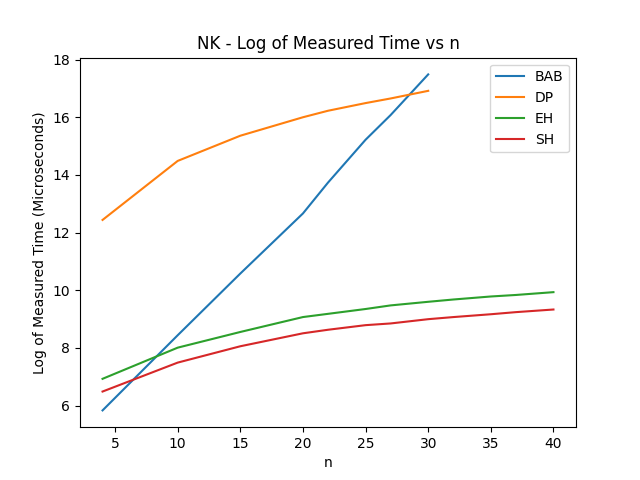
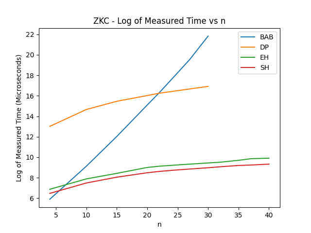
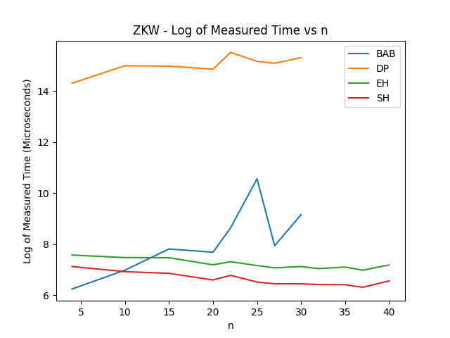

### Algorithm Comparison based on runtime
Branch-and-Bound
\
We can see the most significant increase in runtime for the B&B algorithm. This is because it guarantees the optimal solution, but it has to explore many branches to find it. This makes it slow for large problems.
\
As we already found out in the first homework, the B&B's complexity is O(2^n), which is exponential. This is why the runtime grows so quickly with the problem size.

Dynamic Programming
\
Has a high runtime across all datasets, but its growth with n is less steep compared to BAB.
\
In ZKW, it remains relatively stable and does not exhibit the same sharp increase as BAB in ZKC and NK.

Simple Heuristic
\
The runtime is the lowest across all datasets. 
Shows smaller runtime increase with n, making it ideal for large problem sizes when speed is critical.

Extended Heuristic
\
Similar to the simple heuristic, but with a slightly higher runtime.

### Comparison of average and maximum errors
Now I compared the average and maximum errors for simple and extended heuristics.

For average error:
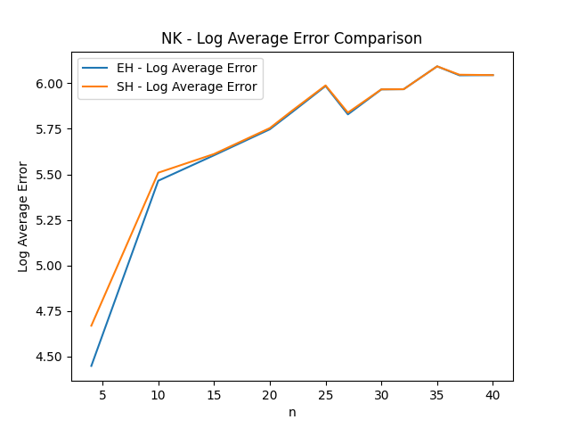
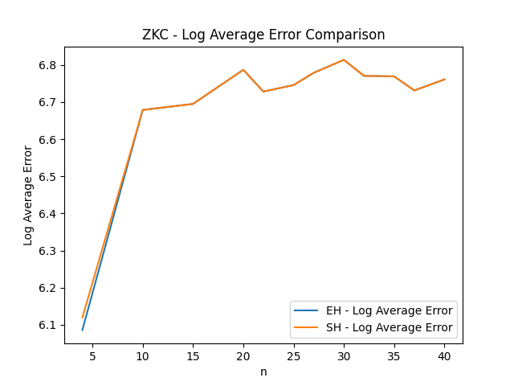
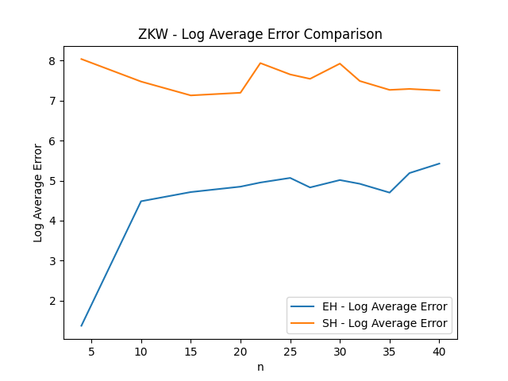

We can see that for the NK and ZKS data types, the average error is lower for the extended heuristic but only for smaller problem sizes. For larger problem sizes, the average error is basically the same.
\
But what is interesting is that for ZKW, there exists a clear distinction between simple and extended heuristics. The average error for the extended heuristic is significantly lower than for the simple heuristic.

For maximum error:
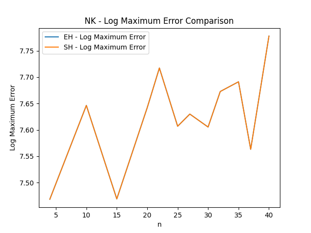
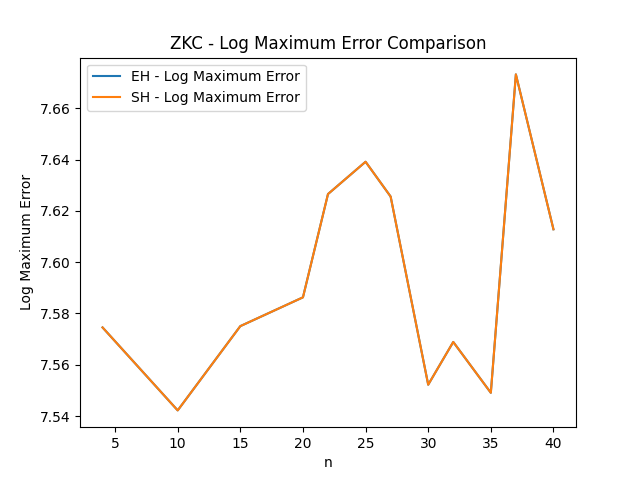
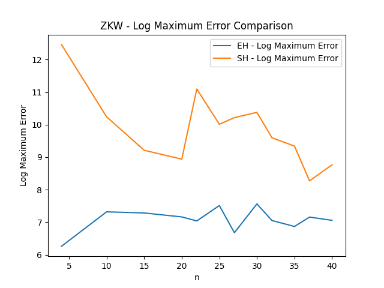

Similar as the average error for NK and ZKC, the maximum error is lower for the extended heuristic for smaller problem sizes. For larger problem sizes, the maximum error is basically the same.
\
Also, for ZKW, the maximum error is significantly lower for the extended heuristic.

From these results, we can conclude that ZKW instances are highly structured, with item weights and values being closely correlated. This structure makes the single most expensive item a more viable candidate for inclusion.
While in other two types this structure is not present, and the extended heuristic performs similarly to the simple heuristic.

### Comparison of FPTAS based on precision
Next I analyzed the relation between precision and runtime, average error, and maximum error for the FPTAS algorithm.

For runtime:

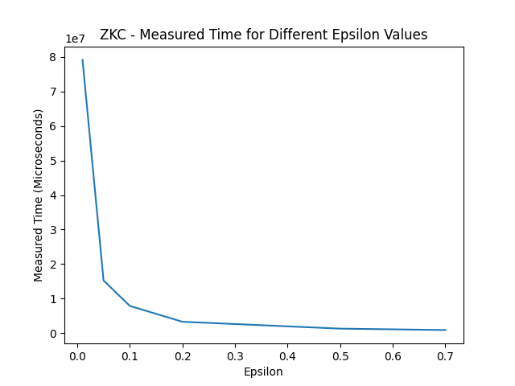
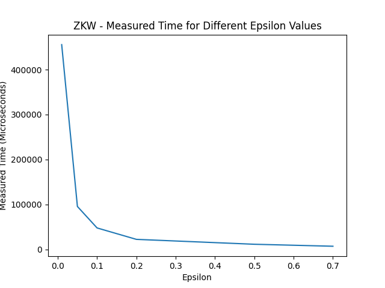

We can see that the runtime increases with decreasing epsilon. This is because the algorithm has to perform more calculations to approximate the solution more accurately.
\
For tiny values like 0.01 the runtime is significantly higher than for 0.1 and all after that. After 0.2 it starts to decrease much slower.

For average error:
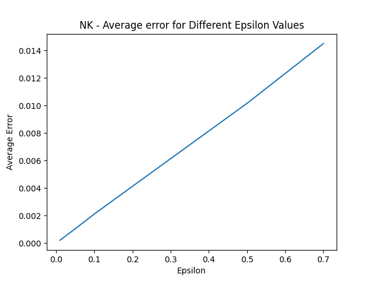
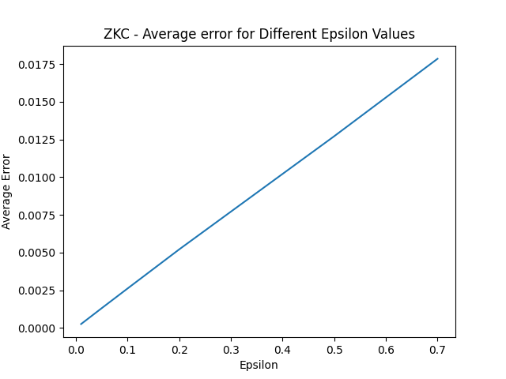
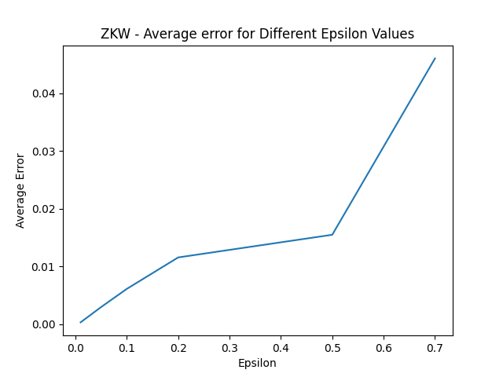

For NK and ZKC, the correlation between epsilon and average error is linear. The average error decreases with increasing precision.
\
For ZKW, the average error is not so perfectly linear, but it still decreases with increasing precision.

For maximum error:
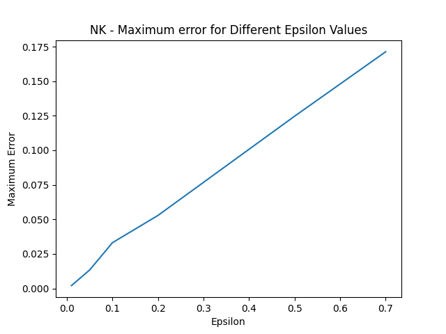
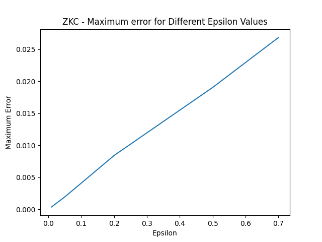
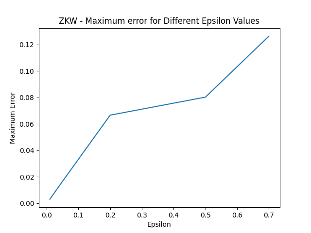

The maximum error behaves similarly to the average error. It decreases with increasing precision. 
\
For NK and ZKC it is a linear decrease, while for ZKW it is not so linear, but still decreases with increasing precision.

We can also conclude that the maximum error is never higher than epsilon, which is expected since the FPTAS algorithm guarantees a solution within a certain margin of error.